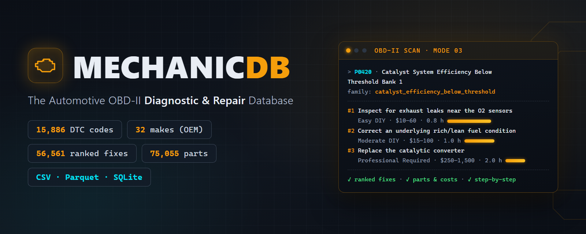

<div align="center">



# 🔧 MechanicDB — Automotive OBD-II Diagnostic & Repair Database

**15,886 verified trouble codes · 9,249 SAE + 6,637 OEM across 32 makes · 56,561 ranked repair procedures · 75,055 parts mappings · 647 authored fault families**

[](https://opendatacommons.org/licenses/odbl/1-0/)
[](#whats-inside)
[](https://www.kaggle.com/datasets/ahtiticheamine/mechanicdb-automotive-obd2-repair-database)
[](https://huggingface.co/datasets/Ichlibitiche/mechanicdb-obd2-repair-sample)
[](CHANGELOG.md)
[](https://mechanicdb-public.pages.dev/)

**[→ Get the full dataset at mechanicdb](https://mechanicdb-public.pages.dev/)**

</div>

---

A structured dataset that turns a check-engine light into an **actionable repair plan**: every Diagnostic Trouble Code (DTC) is mapped to ranked repair procedures with **DIY difficulty ratings, aftermarket parts-cost ranges (USD), labor-hour estimates, and step-by-step instructions** — covering both the universal SAE-standard codes every OBD-II vehicle emits and the manufacturer-specific codes of **32 makes** (Ford, Toyota, BMW, the GM marques, VW/Audi, Honda/Acura, and more).

This repository is the **free, open developer sample**: 90 curated codes (75 SAE + 15 OEM) in the identical schema as the full database, so you can prototype joins, pipelines, and apps before licensing.

## What's inside

| | Full dataset | Free sample |
| :--- | ---: | ---: |
| DTC codes | **15,886** | 90 |
| — SAE-standard (universal) | **9,249** | 75 |
| — OEM manufacturer-specific | **6,637** (32 makes) | 15 |
| Authored fault families | **647** | (linked) |
| Ranked repair procedures | **56,561** | 320 |
| Replacement-parts mappings | **75,055** | 449 |
| Formats | CSV · Parquet · SQLite | CSV · Parquet |

The sample covers the most commonly searched codes (P0420, P0171, P0300, …). Parquet files are Snappy-compressed — **92.0% smaller** than the equivalent CSVs.

| Sample file | Rows | Description |
| :--- | :--- | :--- |
| `dtc_codes.csv` / `.parquet` | 90 | Code registry: DTC, system category, OEM flag/make, fault family, short description, detailed technical explanation |
| `diagnostic_fixes.csv` / `.parquet` | 320 | Ranked repair procedures with difficulty, parts-cost range (USD), labor hours, step-by-step instructions |
| `replacement_parts.csv` / `.parquet` | 449 | Aftermarket part names per fix with catalog search URLs |
| `dtc_fixes_joined.csv` / `.parquet` | 320 | Pre-joined analytical view (codes × fixes) for one-file ingestion |

Full column documentation: [DATA_DICTIONARY.md](DATA_DICTIONARY.md). CSVs are pipe-delimited (`|`), UTF-8 with BOM; string fields are guaranteed free of embedded linebreaks.

## How the content is built (the honest part)

- **Fault-family architecture.** Codes that share a diagnosis and repair path are grouped into one of **647 hand-authored fault families**; each family carries 3–5 repair procedures ranked by likelihood, with 1–3 parts per procedure. Rendered explanations are unique per code — an anti-template test gate enforces it.
- **Costs and labor are editorial estimates** for typical US aftermarket parts and independent-shop labor — not quotes, not scraped prices.
- **OEM rows are per-marque, exactly as sourced.** Makes that share engineering platforms (GM's seven marques, Ford/Mercury/Lincoln, Honda/Acura, …) legitimately share many definitions; rows are kept per marque so `oem_make = 'Buick'` returns complete results. Disclosed in detail in [SOURCES.md](SOURCES.md).
- **Make-level, not model/year-level.** OEM coverage is per manufacturer; the dataset does not claim model- or model-year-specific applicability.
- **No fabricated codes, ever.** Every published code traces to a committed source snapshot; a test gate fails the build otherwise.

## Provenance

- **Code definitions** originate in SAE J2012 / ISO 15031-6 and are compiled from a public, MIT-licensed compilation (attribution in [LICENSE-upstream.txt](LICENSE-upstream.txt); full lineage and transformations in [SOURCES.md](SOURCES.md)).
- **Repair procedures, difficulty ratings, cost ranges, and explanations** are original authored content grounded in standard diagnostic practice.
- Every release is produced by a **deterministic, test-gated build pipeline**: referential integrity, anti-template uniqueness, and no-fabricated-codes gates; rebuilds are byte-identical.

## Pricing

| Tier | What | Price |
| :--- | :--- | :--- |
| **Sample** | 90 codes (this repo + Kaggle) | Free |
| **Standard** | 9,249 SAE codes · 32,767 fixes · 44,588 parts · CSV + Parquet + SQLite | **[$49](https://buy.stripe.com/5kQ3cw7Be9b88rNfuU38403)** one-time |
| **OEM Complete** | Full merged dataset: 15,886 codes (+ 6,637 OEM across 32 makes) · 56,561 fixes · 75,055 parts | **[$149](https://buy.stripe.com/28EfZicVy0ECdM796w38404)** one-time |

Both paid tiers are self-serve: secure Stripe checkout (card / Apple Pay / Google Pay), **instant download** after payment, commercial license included in the archive.

**[→ Get it at mechanicdb](https://mechanicdb-public.pages.dev/)** · or email **[mechanicdb.urologist336@simplelogin.com](mailto:mechanicdb.urologist336@simplelogin.com)** for a company invoice or custom licensing.

## Use cases

- OBD-II scanner apps and hardware dongles (code → explanation → ranked fixes in one join)
- AI mechanic co-pilots and RAG corpora over automotive diagnostics
- Repair-estimate and shop-management software (difficulty, parts-cost, and labor-hour matrices)
- Used-vehicle valuation and inspection tooling (severity and repair-cost context per code)

## Quickstart

```python
import pandas as pd

df = pd.read_csv("dtc_fixes_joined.csv", sep="|", encoding="utf-8-sig")
easy = df[df["difficulty_level"] == "Easy DIY"]
print(easy[["dtc_code", "short_description", "fix_title", "est_parts_cost_min_usd"]].head())
```

```python
import duckdb

print(duckdb.query("""
    SELECT dtc_code, fix_title, difficulty_level, est_parts_cost_min_usd
    FROM 'dtc_fixes_joined.parquet'
    ORDER BY est_parts_cost_min_usd
    LIMIT 10
""").df())
```

## License

- **Sample dataset (this repo):** [Open Database License (ODbL) v1.0](https://opendatacommons.org/licenses/odbl/1-0/) — free for research, education, and benchmarking with attribution and share-alike (see [LICENSE](LICENSE)).
- **Full dataset:** commercial license, self-serve at [mechanicdb](https://mechanicdb-public.pages.dev/) — see [Pricing](#pricing).
- **Documentation:** CC BY 4.0.

⚠️ **Safety:** repair steps are educational reference material, not a substitute for the vehicle manufacturer's service manual. High-voltage (hybrid/EV) and SRS/airbag procedures must only be performed by qualified technicians following the manufacturer's lockout and de-energization procedures.

Spotted a wrong fix, cost, or code definition? See [CONTRIBUTING.md](CONTRIBUTING.md) or email **[mechanicdb.urologist336@simplelogin.com](mailto:mechanicdb.urologist336@simplelogin.com)**.

## Also on Kaggle & Hugging Face

The same sample is published on Kaggle — **[MechanicDB: OBD-II Diagnostic & Repair Database](https://www.kaggle.com/datasets/ahtiticheamine/mechanicdb-automotive-obd2-repair-database)** (with a [starter notebook](https://www.kaggle.com/code/ahtiticheamine/decode-your-check-engine-light-with-mechanicdb)) — and on Hugging Face as **[Ichlibitiche/mechanicdb-obd2-repair-sample](https://huggingface.co/datasets/Ichlibitiche/mechanicdb-obd2-repair-sample)** (4 parquet configs, loadable with `datasets`).
